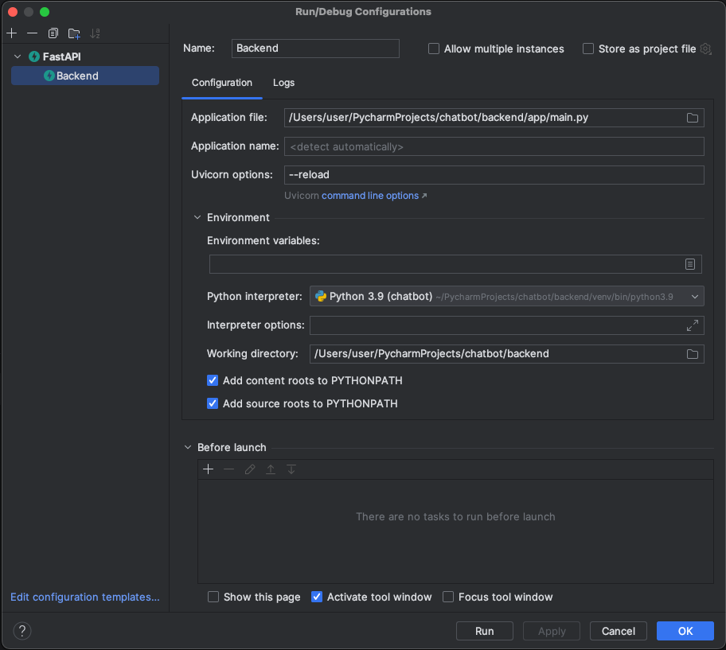

# Setup

## Database
```shell
brew install postgresql@14  
```

```shell
brew install pgvector
```

```shell
createdb chatbot
```

```shell
psql -d chatbot
```

```shell
CREATE EXTENSION pgvector;
```

## Backend

```shell
brew install tesseract
```

Copy the sample env and set your variables in .env

```shell
cp sample.env .env
```

Run configurations in PyCharm:


## Frontend
Start app:

```shell
npm start
```